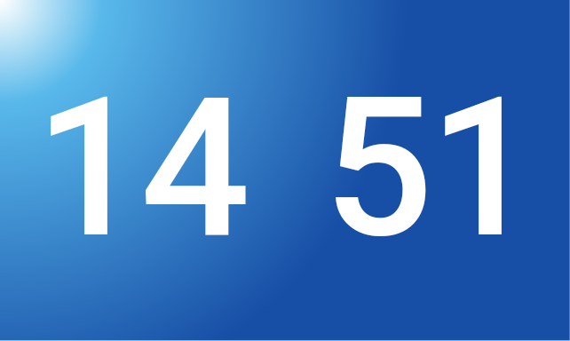
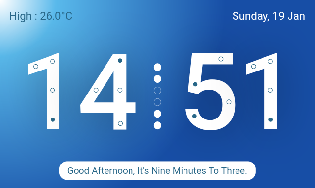

# Digital Clock

Flutter Clock is an implementation of a digital clock in Flutter.
It has a light theme and a dark theme.

It has 3 Types Clock in it.
1. Digital Clock.
2. Binary Clock.
3. Text Clock.

Digital Clock will show time as normal clock, but it does not end there, digital clock has circles on it, these shows numbers in binary format, and another clock is text clock, which shows time in text format, not just that. it wishes every minute, just like other digital clocks it has weather and day details. If you are a techy, you will like the clock with binary language. It has ticker in the middle, ticker seems like climbing dots or snake animation, but they are implemented using binary digits, for unknown people they seems like an animation but for known people it will entertain meaningfully.
Weather details update every 20 secs covering Avg, Min, Max temperatures as well as weather condition.

Benifits :
- Its code is optimised for smart clocks which have less powerful chips and ram resources.
- Contains both light and dark themes.
- Simple and modern design.
- design is familiar to most smart clocks.

